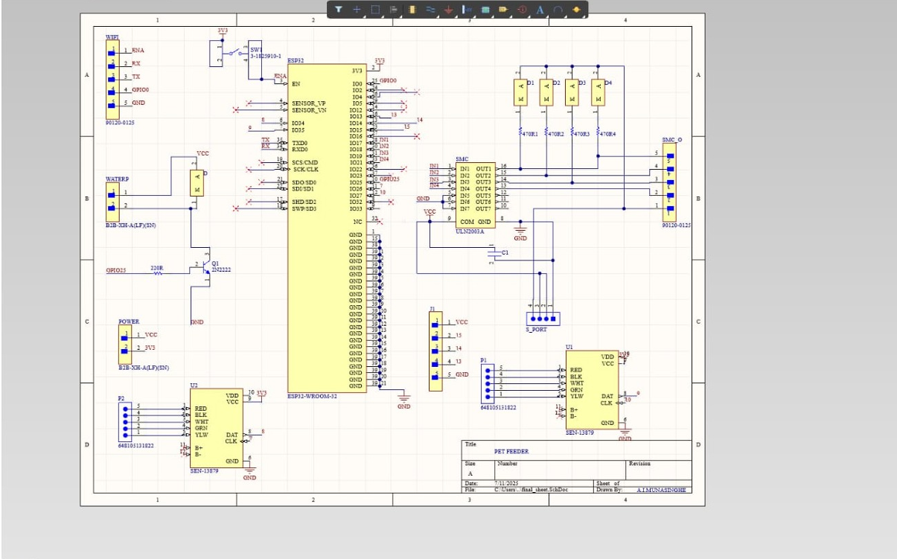
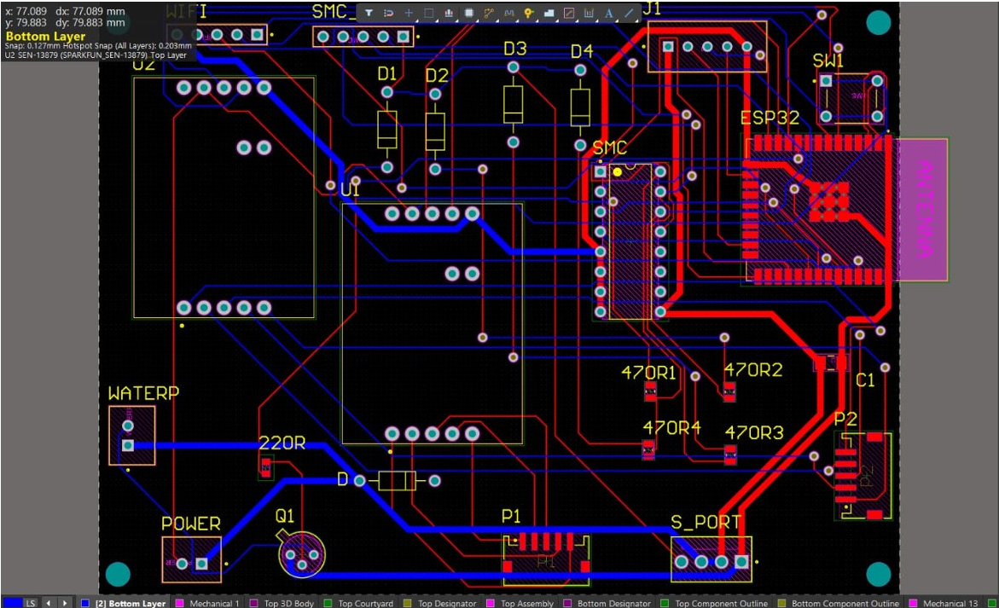
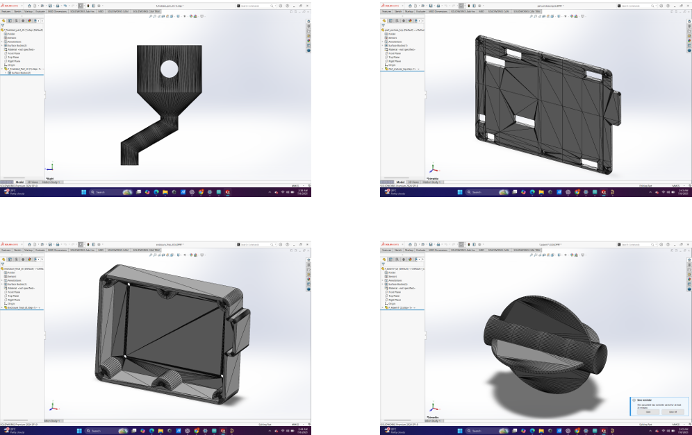
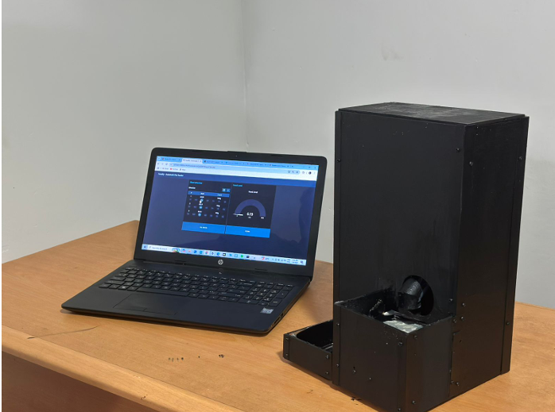

# 🐾 Automatic Pet Feeder with ESP32 & MQTT

This project demonstrates the design and implementation of an **IoT-enabled Automatic Pet Feeder** developed during our semester project. The system is built using a **custom-designed PCB with an ESP32 microcontroller**, enabling **remote feeding control and monitoring via MQTT communication**.

The feeder allows users to **schedule feeding times or trigger feeding remotely**, ensuring pets receive food consistently even when the owner is away.

---

## 🚀 Key Features

### 🌐 IoT Connectivity
Uses **MQTT protocol over WiFi** to communicate with a cloud/server broker, allowing remote control and monitoring.

### ⏱️ Scheduled Feeding
Users can configure **feeding schedules** so pets are fed automatically at specific times.

### 📲 Remote Feeding Control
Pet owners can **trigger feeding manually through MQTT messages** from a mobile app or dashboard.

### ⚙️ Custom PCB Design
The system is implemented on a **custom-designed PCB integrating the ESP32 chip**, motor driver, and power regulation circuitry.

### 🔄 Reliable Dispensing Mechanism
A **servo/DC motor-based dispensing mechanism** accurately releases a controlled amount of food.

---

# ⚙️ System Functionality

🔰 **WiFi & MQTT Initialization**  
When powered on, the ESP32 connects to a WiFi network and an MQTT broker. The device subscribes to specific MQTT topics for receiving feeding commands.

🔰 **Feeding Command Reception**  
When a message is received on the feeding control topic, the ESP32 processes the command and activates the feeding mechanism.

🔰 **Food Dispensing Mechanism**  
The ESP32 drives a motor or servo connected to the food container which rotates the dispensing mechanism to release food into the bowl.

🔰 **Scheduled Feeding Logic**  
A built-in timer checks predefined feeding schedules and automatically triggers feeding events.

🔰 **Status Feedback**  
After dispensing food, the device publishes status updates to the MQTT broker so the user can confirm successful feeding.

---

# 🛠️ Hardware Components

- **ESP32 (Custom PCB)** – Main microcontroller with integrated WiFi  
- **Servo Motor / DC Motor** – Drives the food dispensing mechanism  
- **Motor Driver Circuit** – Controls motor operation from ESP32  
- **Power Regulation Circuit** – Provides stable voltage supply  
- **Food Container & Mechanical Dispenser** – Stores and releases pet food  
- **Custom Designed PCB** – Integrates all system components

---

# 💻 Software Technologies

- **ESP32 Firmware** – Developed using Arduino framework / MicroPython  
- **MQTT Protocol** – Lightweight messaging protocol for IoT devices  
- **WiFi Connectivity** – Enables communication with MQTT broker  
- **MQTT Broker** – Sends commands and receives device status

---

# 🖼️ Visuals of the Project

<strong>SCHEMATIC</strong>

<strong>PCB DESIGN</strong>

<strong>ASSEMBLED PCB</strong>

<strong>ENCLOSURE</strong>

<strong>FINAL PRODUCT</strong>

<strong>PROTOTYPE</strong>

<strong>System Architecture</strong>

---

# 📡 MQTT Communication Structure

Example topics used in the system:
